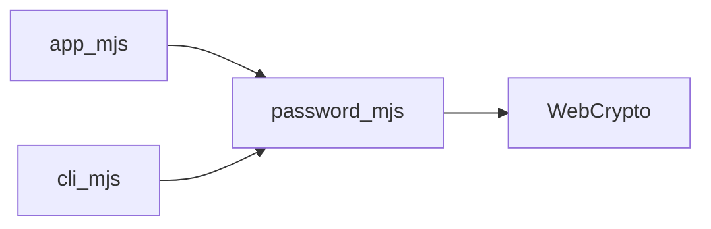

# Roteiro de demonstração técnica

---

## 1. Problema e escopo

**Problema (30–45 s):** senhas fracas ou previsíveis; serviços opacos em que o usuário não controla onde a senha passa; uso indevido de `Math.random()` para segurança.

**Solução deste projeto:** gerador **local** — a página roda no **navegador**, a CLI no **Node** — com a mesma lógica em [`web/password.mjs`](web/password.mjs) e aleatoriedade só com **`crypto.getRandomValues`**.

**Escopo:** comprimento 8–64, conjuntos opcionais (minúsculas, maiúsculas, dígitos, símbolos), política “garantir um de cada conjunto”, até 20 senhas por geração na web; **no mesmo pedido**, as N linhas são **distintas entre si** (`Set` + retentativas no núcleo). **Fora de escopo:** servidor que armazene ou trate senhas em backend próprio; o projeto **não persiste** senhas geradas.

---

## 2. Arquitetura resumida (45–60 s)

Um único **núcleo** (`password.mjs`) é usado por dois **consumidores**: a página (`app.mjs` + `index.html`) e a linha de comando (`cli.mjs`). O diagrama Mermaid está no [README.md](README.md) (seção **Arquitetura**).



---

## 3. Execução (web + CLI) (60–90 s)

**Web**

1. Abrir [`web/index.html`](web/index.html) (arquivo local) **ou** servir a pasta `web/` com um servidor HTTP (recomendado para testar **Copiar resultado**).
2. Clicar em **Gerar** com valores padrão e mostrar o resultado na área de texto.

**Servidor HTTP (opcional, na raiz do repositório)** — para `http(s):` e testar **Copiar resultado**:

```bash
npm install
npx serve web
```

Abrir o URL **Local** (ou **Network**) que o terminal indicar.

**CLI** (na **raiz** do repositório, com [Node.js](https://nodejs.org/) 19+; após `npm install`):

```bash
npx gerar-senha --length 16 --count 2
```

Alternativa em desenvolvimento: `node cli.mjs --length 16 --count 2`.

Mostrar uma ou duas linhas de senha no **stdout**; com `--count` maior, cada linha é **diferente das outras nessa execução**. Erros de validação (ou impossibilidade de obter N distintas com os parâmetros) vão para **stderr** com código de saída **2**.

---

## 4. Fluxo principal da interface (45–60 s)

O fluxo é **configurar → gerar → (opcional) copiar**.

1. Alterar **comprimento** ou desmarcar um conjunto (ex.: só minúsculas + dígitos) e **Gerar** de novo.
2. Opcional: marcar **Garantir ao menos um caractere de cada conjunto marcado** e gerar.
3. Clicar em **Copiar resultado** (com `http(s):`) e apontar a **mensagem verde** de confirmação.
4. Opcional rápido: valor inválido (ex. comprimento fora de 8–64) e mostrar a **mensagem de erro** em vermelho.

---

## 5. Evidência de testes (30–45 s)

Na raiz:

```bash
npm test
```

Referência: [`test/password.test.mjs`](test/password.test.mjs) (núcleo) e [`test/cli.test.mjs`](test/cli.test.mjs) (CLI), via `node:test`. Cobertura inclui `validate`, geração dentro do alfabeto, `requireEach`, `generateDistinctPasswords`, smoke test de aleatoriedade e integração da CLI (incluindo lote com linhas distintas). Esperado: todas as linhas com **pass** e **fail 0**.

---

## Ligações úteis

- [README.md](README.md) — visão geral, requisitos, como executar, estrutura, IA (CO-STAR).
- [GUIA_DE_EXECUCAO.md](GUIA_DE_EXECUCAO.md) — passos locais, checklist, commits, CO-STAR detalhado.
