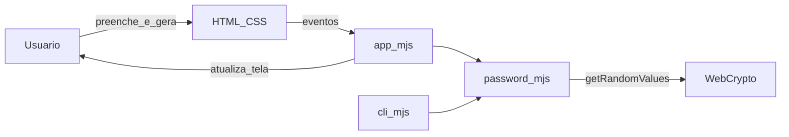

# Guia de execução — Gerador de senhas (web estática)

Este repositório contém a interface em [web/](web/) (HTML, CSS, JavaScript) **e** uma CLI Node na raiz (`cli.mjs`) que reutiliza o mesmo núcleo [web/password.mjs](web/password.mjs). Não há servidor de aplicação próprio no repositório.

---

## 1. Pré-requisitos

| Item | Detalhe |
|------|---------|
| Navegador | Chrome, Firefox, Edge ou equivalente |
| Git | Opcional, para clonar o repositório |
| Node.js | **19+** para a CLI e testes (`npm install`, `npx gerar-senha`, `npm test`) |

---

## 2. Obter o código

```bash
cd d:\gerarSenha
```

---

## 3. Rodar localmente

### Abrir a página no navegador (ficheiro local)

1. Abre no Explorador de ficheiros a pasta **`web/`** do projeto (ex.: após `cd d:\gerarSenha`, o ficheiro é `d:\gerarSenha\web\index.html`).
2. **Duplo clique** em **`index.html`**, ou **arrasta** o ficheiro para uma janela do Chrome, Edge ou Firefox.  
   Outra forma: no navegador, menu **Ficheiro → Abrir ficheiro…** (`Ctrl+O`) e seleciona `index.html` dentro de `web/`.
3. Verifica na barra de endereços um URL **`file:///…/web/index.html`**; a página carrega `styles.css` e `app.mjs` a partir da mesma pasta.

**Limitação:** com `file://`, **Copiar resultado** costuma falhar ou pedir permissões extra; para testar a cópia, usa a secção seguinte (servidor HTTP).

### Servidor HTTP (recomendado para testar “Copiar resultado”)

Sirva a pasta **`web/`** como site estático com a ferramenta que preferir no seu ambiente (extensão de **Live Server** / preview no editor, hospedagem estática de teste, etc.). Acesse a URL indicada (em geral `http://127.0.0.1` com alguma porta).

- Use **Gerar** para criar senhas conforme o formulário.
- **Copiar resultado** usa `navigator.clipboard` (costuma exigir contexto `http(s):`, não `file:`).

### Linha de comando (mesma lógica que o front)

Na **raiz** do clone (não dentro de `web/`):

1. Instale e registe o binário local: `npm install`
2. Ajuda: `npx gerar-senha --help`
3. Exemplo: `npx gerar-senha --length 24 --count 3 --require-each` ou `node cli.mjs ...`

O navegador continua a usar só ficheiros estáticos servidos a partir de `web/`; a CLI importa `web/password.mjs` no Node.

### Testes automatizados (`npm test`)

Na **raiz** do repositório (com Node 19+):

1. `npm test` — executa [`node:test`](https://nodejs.org/api/test.html) sobre [test/password.test.mjs](test/password.test.mjs).
2. O ficheiro importa [web/password.mjs](web/password.mjs) e cobre: regras de `validate`, geração só com caracteres dos conjuntos ativos, política `requireEach` (quatro tipos) e uma verificação de fumo de unicidade entre várias gerações.

Equivalente direto: `node --test ./test/password.test.mjs`.

---

## 4. Estrutura

| Caminho | Função |
|---------|--------|
| [web/index.html](web/index.html) | Estrutura da página e campos |
| [web/password.mjs](web/password.mjs) | Núcleo: validação e geração com `crypto.getRandomValues` |
| [web/app.mjs](web/app.mjs) | Formulário, eventos e cópia para o clipboard |
| [web/styles.css](web/styles.css) | Aparência e contraste |
| [cli.mjs](cli.mjs) (raiz) | CLI Node; importa `password.mjs` |
| [package.json](package.json) | `type: "module"`, `bin`, `engines`, script `test` |
| [test/password.test.mjs](test/password.test.mjs) | Testes do núcleo (`npm test` / `node:test`) |

---

## 5. Diagrama do fluxo (Mermaid)

**Vantagens de Mermaid no markdown:** versionável no Git e fácil de revisar em pull request.



**Nota:** o fluxo didático **Cliente → API → Service → Repository → Storage** do material refere-se a sistemas com API e persistência. Aqui a geração ocorre **no navegador** (módulo `password.mjs` via `app.mjs`) ou **no terminal** (mesmo `password.mjs` via `cli.mjs`), sem camada de API própria neste repositório.

---

## 6. Checklist rápido

- [ ] `web/index.html` abre no navegador e o formulário funciona
- [ ] Com servidor local, “Copiar resultado” funciona quando aplicável
- [ ] `npx gerar-senha --help` e geração na CLI funcionam (Node 19+)
- [ ] `npm test` passa (testes do `password.mjs`)
- [ ] README atualizado e repositório no Git com histórico claro

---

## 7. Git e Conventional Commits

**Formato:** `tipo(escopo): descrição`

**Exemplos (disciplina):**

```text
feat(api): adiciona endpoint POST /tasks
fix(service): corrige validação de prioridade
test(tasks): adiciona testes para criação de tarefa
docs(readme): inclui guia de execução
```

**Exemplos (este projeto):**

```text
feat(web): melhora feedback visual de erros
fix(web): corrige cópia no Safari
test(password): cobre validate com requireEach
docs(guia): detalha execução com servidor estático local
```

```bash
git add web/app.mjs web/password.mjs
git commit -m "fix(web): corrige mensagem de validação"
```

```bash
git add test/password.test.mjs web/password.mjs
git commit -m "test(password): reforça validação e geração"
```

O padrão também está resumido no [README.md](README.md).

---

## 11. CO-STAR (exemplo para este MVP)

Ao pedir **código-fonte** (humano ou IA generativa), use sempre o framework **CO-STAR** no prompt. **Regra obrigatória deste repositório:** o fonte gerado ou alterado deve sair **completamente documentado** — em JavaScript, **JSDoc** em todo `function`/API relevante (`@param`, `@returns`, `@typedef` quando couber); em HTML, comentários ou texto de apoio onde esclarecer comportamento; nada de funções “misteriosas” sem explicar propósito e contratos.

| Letra | Significado | Preenchimento (este projeto) |
|-------|-------------|------------------------------|
| **C** — Contexto | Projeto, stack, restrições | Repositório **gerarSenha**: `web/index.html`, `web/password.mjs`, `web/app.mjs`, `web/styles.css`, `cli.mjs`, `test/password.test.mjs`; front estático; CLI Node; testes `node:test`; aleatoriedade com **`crypto.getRandomValues`**. |
| **O** — Objetivo | O que deve ser entregue | Ajustar ou revisar geração de senhas (8–65 caracteres), conjuntos opcionais, política mínima, quantidade até 20, cópia no navegador e/ou saída na CLI; mensagens de erro claras em português; **testes automatizados** do núcleo (`npm test`); **código 100% documentado (JSDoc + regra abaixo)**. |
| **S** — Estilo e convenções | Padrões | **Conventional Commits** em português; JS legível, sem dependências de build obrigatórias; **obrigatório:** documentação inline completa no mesmo PR/commit que introduz o código. |
| **T** — Tom | Como escrever | Textos de UI, mensagens de erro e **JSDoc** em **português** (ou termos técnicos universais quando inevitáveis), diretos. |
| **A** — Audiência | Quem usa | Usuário final no navegador; corretor/colegas lendo o repositório; quem mantém o JS precisa entender funções só lendo os comentários. |
| **R** — Formato da resposta | Saída esperada | Alterações em `web/` **com JSDoc em todas as funções novas ou alteradas**; se pedir diagrama, **Mermaid** no markdown; **não aceitar** entrega de lógica sem documentação equivalente. |

**Exemplo de prompt curto (inclui obrigatoriedade de documentar):**

> **Contexto:** Repositório `gerarSenha`, ficheiros `web/password.mjs` / `web/app.mjs`.  
> **Objetivo:** Limitar quantidade máxima a 10 em vez de 20.  
> **Estilo:** Conventional Commits; não adicionar frameworks; **todo código entregue com JSDoc completo**.  
> **Tom:** técnico, português.  
> **Audiência:** mantenedor.  
> **Resposta:** patch em `password.mjs`, `app.mjs` e `index.html` se o `max` do input mudar; **cada função tocada deve ter bloco `/** … */` atualizado**.

---

*Última atualização: web estática em `web/` + CLI Node na raiz + testes `node:test` em `test/`.*
