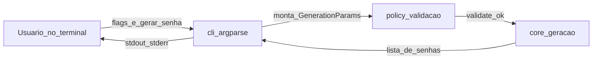

# Guia de execução — MVP Gerador de senhas seguras (Unidade 2)

Este documento descreve **como preparar o ambiente, instalar, usar a CLI e validar o projeto** conforme o miniprojeto do plano: core + policy + CLI (`argparse`), testes (`pytest` + `hypothesis`), RNG seguro (`secrets` / `SystemRandom`) e critérios **RF01–RF05** (RF05: clipboard com confirmação e limpeza opcional).

---

## 1. Pré-requisitos

| Item | Detalhe |
|------|---------|
| Python | **3.10 ou superior** |
| Git | Para clonar o repositório (se aplicável) |
| Terminal | PowerShell, CMD ou bash |

Confirme a versão:

```bash
python --version
```

---

## 2. Obter o código

```bash
cd d:\gerarSenha
```

(Se o projeto estiver em outro caminho, use o diretório raiz onde está o arquivo `pyproject.toml`.)

---

## 3. Ambiente virtual (recomendado)

**Windows (PowerShell):**

```powershell
python -m venv .venv
.\.venv\Scripts\Activate.ps1
```

**Linux / macOS:**

```bash
python3 -m venv .venv
source .venv/bin/activate
```

---

## 4. Instalação do pacote (modo editável + dependências de desenvolvimento)

Na **raiz do repositório** (onde está `pyproject.toml`):

```bash
python -m pip install --upgrade pip
python -m pip install -e ".[dev]"
```

Isso instala o pacote `pwgen` a partir de `src/` e registra o comando **`gerar-senha`**.

**Se `pip install -e` falhar ao ler `README.md` (encoding no Windows):** o `pyproject.toml` pode não referenciar `readme`; nesse caso a instalação usa só a `description`. O arquivo `README.md` continua no repositório para leitura humana.

---

## 5. Executar a CLI

Com o ambiente virtual **ativado** e a instalação concluída:

| Objetivo | Comando |
|----------|---------|
| Ajuda | `gerar-senha --help` |
| Uso padrão (16 caracteres, todos os conjuntos) | `gerar-senha` |
| Comprimento e quantidade (RF01, RF04) | `gerar-senha --length 20 --count 3` |
| Desligar símbolos / dígitos / maiúsculas / minúsculas (RF02) | `gerar-senha --no-symbols` (idem `--no-digits`, `--no-upper`, `--no-lower`) |
| Política mínima: ≥1 de cada conjunto selecionado (RF03) | `gerar-senha --length 16 --require-each` |
| Copiar para o clipboard após confirmar (RF05; exige `--count 1`) | `gerar-senha --copy` |
| RF05 com limpeza tardia do clipboard (segundos; só se o texto ainda for a senha) | `gerar-senha --copy --copy-clear-after 45` |

**Saída:** uma senha por linha no **stdout**.  
**Erros de validação:** mensagem no **stderr**, código de saída **2**.  
**RF05:** depende de **`pyperclip`** (dependência principal do projeto). Responda `s`/`sim`/`y` para copiar; `N` ou Enter cancela. **`--copy`** com `--count` diferente de **1** termina com código **2**.

### Executar sem instalar o entrypoint (alternativa)

Útil para depuração, com `PYTHONPATH` apontando para `src`:

**PowerShell:**

```powershell
$env:PYTHONPATH = "src"
python -m pwgen.cli --help
```

---

## 6. Testes automatizados

Na raiz do projeto:

```bash
python -m pytest
```

Com mais detalhe:

```bash
python -m pytest -v
```

O `pyproject.toml` já define `testpaths = ["tests"]` e `pythonpath = ["src"]`.

---

## 7. Lint e formatação (Ruff)

```bash
python -m ruff check src tests
python -m ruff format --check src tests
```

Para aplicar formatação:

```bash
python -m ruff format src tests
```

---

## 8. Estrutura esperada (plano)

| Caminho | Função |
|---------|--------|
| [src/pwgen/core.py](src/pwgen/core.py) | Geração e conjuntos de caracteres |
| [src/pwgen/policy.py](src/pwgen/policy.py) | Validação (comprimento 8–64, conjuntos, `--require-each`) |
| [src/pwgen/cli.py](src/pwgen/cli.py) | `argparse`, saída e código de saída |
| [tests/](tests/) | `test_core`, `test_policy`, `test_cli` (+ Hypothesis onde aplicável) |

### Diagrama do fluxo (Mermaid)

**Vantagens de diagramas como código (Mermaid):** versionáveis no Git, fáceis de revisar em pull request e de atualizar quando a arquitetura mudar.

**Nota:** o fluxo didático **Cliente → API → Service → Repository → Storage** descreve sistemas com **API e armazenamento**. Aqui o “cliente” é o **usuário no terminal**; não há API REST nem repositório de dados — apenas **CLI**, **policy** (regras) e **core** (geração com `secrets` / RNG injetável nos testes).



---

## 9. Checklist rápido de “pronto para entrega”

- [ ] `python -m pip install -e ".[dev]"` conclui sem erro  
- [ ] `gerar-senha --help` exibe as flags  
- [ ] `python -m pytest` — todos os testes passando  
- [ ] Repositório com `.gitignore` adequado (`__pycache__`, `.venv`, `.pytest_cache`, etc.)  
- [ ] README ou documentação com objetivo e exemplos (ver [README.md](README.md))  
- [ ] RF05: `gerar-senha --copy` pede confirmação antes de copiar; opcional `--copy-clear-after N`  

---

## 10. Git e Conventional Commits (padrão do repositório)

O histórico deve seguir **[Conventional Commits](https://www.conventionalcommits.org/)** na prática:

**Formato:** `tipo(escopo): descrição`

- **tipo:** `feat`, `fix`, `test`, `docs`, `chore`, etc.
- **escopo:** opcional; ex.: `pwgen`, `cli`, `policy`, `core`, `tests`, `readme`, `guia`
- **descrição:** curta, em português, modo imperativo (ex.: “adiciona”, “corrige”, “inclui”)

**Exemplos alinhados ao material da disciplina:**

```text
feat(api): adiciona endpoint POST /tasks
fix(service): corrige validação de prioridade
test(tasks): adiciona testes para criação de tarefa
docs(readme): inclui guia de execução
```

**Exemplos neste projeto:**

```text
feat(pwgen): adiciona política mínima com --require-each
fix(cli): corrige código de saída em erro de validação
test(policy): adiciona casos para comprimento e conjuntos
docs(guia): atualiza passos de instalação no Windows
```

**Fluxo básico:**

```bash
git status
git add caminho/do/arquivo
git commit -m "docs(readme): inclui guia de execução"
```

Convém commitar **antes** de incluir `.venv/`; o `.gitignore` já ignora ambientes virtuais comuns.

O padrão também está resumido no [README.md](README.md).

---

## 11. CO-STAR (exemplo para este MVP)

O acrônimo **CO-STAR** organiza um prompt (ou um pedido de implementação) em partes: **C**ontexto, **O**bjetivo, **E**stilo, **T**om, **A**udiência, **R**esposta esperada.

Abaixo, um exemplo **já preenchido** para o projeto **gerador de senhas seguras** (repositório `gerarSenha`), útil como modelo ao usar IA generativa ou ao descrever tarefas para a equipe.

| Letra | Significado | Preenchimento (este projeto) |
|-------|-------------|------------------------------|
| **C** — Contexto | Projeto, stack, restrições | MVP da Unidade 2 em **Python 3.10+**, pacote em `src/pwgen/`, CLI com **argparse**, testes com **pytest** e **hypothesis**, RNG seguro com **`secrets.choice`** e embaralhamento com **`SystemRandom`** em produção; **sem** API REST, **sem** banco de dados. |
| **O** — Objetivo | O que deve ser entregue | Implementar ou revisar geração de senhas com comprimento 8–64, flags para minúsculas/maiúsculas/dígitos/símbolos, `--count`, `--require-each`, saída no stdout, **RF05** (`--copy` com confirmação, `pyperclip`, opcional `--copy-clear-after`), código de saída 2 em erro de validação; core **sem** dependência de CLI para facilitar testes. |
| **S** — Estilo e convenções | Padrões de código e Git | **Conventional Commits** em português (`feat(cli): …`, `docs(readme): …`); formatação/lint com **ruff**; tipagem e nomes alinhados aos módulos existentes (`core`, `policy`, `cli`). |
| **T** — Tom | Como escrever textos | Documentação e mensagens de erro em **português**, **claro** e **direto**; termos técnicos (CLI, stdout, stderr) quando necessário. |
| **A** — Audiência | Quem lê ou usa | Corretor da disciplina, colegas do curso e desenvolvedores que clonam o repositório; assume familiaridade básica com terminal e Python. |
| **R** — Formato da resposta | O que se espera como saída | Código Python nos caminhos corretos; comandos reproduzíveis no README/guia; para revisão de arquitetura, preferir **diagrama Mermaid** no markdown; testes automatizados passando. |

**Exemplo de prompt curto usando a mesma lógica:**

> **Contexto:** Repositório `gerarSenha`, Python, `src/pwgen/core.py` e `policy.py`.  
> **Objetivo:** Ajustar a validação para aceitar apenas comprimentos pares (hipotético).  
> **Estilo:** Manter Conventional Commits e não quebrar os testes existentes.  
> **Tom:** técnico, em português.  
> **Audiência:** mantenedor do projeto.  
> **Resposta:** diff sugerido + atualizar `test_policy.py` se necessário.

---

*Última atualização alinhada ao MVP CLI Python do plano Unidade 2.*
