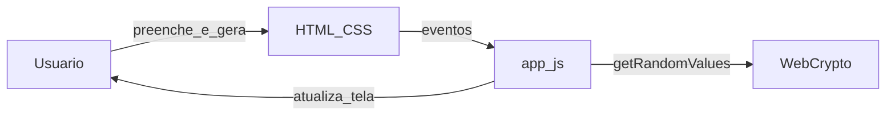

# Guia de execução — Gerador de senhas (web estática)

Este repositório contém **apenas** a interface em [web/](web/): HTML, CSS e JavaScript, sem backend.

---

## 1. Pré-requisitos

| Item | Detalhe |
|------|---------|
| Navegador | Chrome, Firefox, Edge ou equivalente |
| Git | Opcional, para clonar o repositório |

---

## 2. Obter o código

```bash
cd d:\gerarSenha
```

---

## 3. Rodar localmente

### Abrir direto o HTML

1. Entre na pasta `web/`.
2. Abra **`index.html`** no navegador (duplo clique ou arrastar para a janela).

### Servidor HTTP (recomendado para testar “Copiar resultado”)

Sirva a pasta **`web/`** como site estático com a ferramenta que preferir no seu ambiente (extensão de **Live Server** / preview no editor, hospedagem estática de teste, etc.). Acesse a URL indicada (em geral `http://127.0.0.1` com alguma porta).

- Use **Gerar** para criar senhas conforme o formulário.
- **Copiar resultado** usa `navigator.clipboard` (costuma exigir contexto `http(s):`, não `file:`).

---

## 4. Estrutura

| Caminho | Função |
|---------|--------|
| [web/index.html](web/index.html) | Estrutura da página e campos |
| [web/app.js](web/app.js) | Validação (8–64, conjuntos, política mínima), geração com `crypto.getRandomValues` |
| [web/styles.css](web/styles.css) | Aparência e contraste |

---

## 5. Diagrama do fluxo (Mermaid)

**Vantagens de Mermaid no markdown:** versionável no Git e fácil de revisar em pull request.



**Nota:** o fluxo didático **Cliente → API → Service → Repository → Storage** do material refere-se a sistemas com API e persistência. Aqui tudo ocorre **no cliente** (navegador), sem camada de API própria.

---

## 6. Checklist rápido

- [ ] `web/index.html` abre no navegador e o formulário funciona
- [ ] Com servidor local, “Copiar resultado” funciona quando aplicável
- [ ] README atualizado e repositório no Git com histórico claro

---

## 7. Git e Conventional Commits

**Formato:** `tipo(escopo): descrição`

**Exemplos (disciplina):**

```text
feat(api): adiciona endpoint POST /tasks
fix(service): corrige validação de prioridade
test(tasks): adiciona testes para criação de tarefa
docs(readme): inclui guia de execução
```

**Exemplos (este projeto):**

```text
feat(web): melhora feedback visual de erros
fix(web): corrige cópia no Safari
docs(guia): detalha execução com servidor estático local
```

```bash
git add web/app.js
git commit -m "fix(web): corrige mensagem de validação"
```

O padrão também está resumido no [README.md](README.md).

---

## 11. CO-STAR (exemplo para este MVP)

Ao pedir **código-fonte** (humano ou IA generativa), use sempre o framework **CO-STAR** no prompt. **Regra obrigatória deste repositório:** o fonte gerado ou alterado deve sair **completamente documentado** — em JavaScript, **JSDoc** em todo `function`/API relevante (`@param`, `@returns`, `@typedef` quando couber); em HTML, comentários ou texto de apoio onde esclarecer comportamento; nada de funções “misteriosas” sem explicar propósito e contratos.

| Letra | Significado | Preenchimento (este projeto) |
|-------|-------------|------------------------------|
| **C** — Contexto | Projeto, stack, restrições | Repositório **gerarSenha**, front **estático**: `web/index.html`, `web/app.js`, `web/styles.css`; sem backend; aleatoriedade com **`crypto.getRandomValues`**. |
| **O** — Objetivo | O que deve ser entregue | Ajustar ou revisar geração de senhas (8–64 caracteres), conjuntos opcionais, política mínima, quantidade até 20, cópia para clipboard; mensagens de erro claras em português; **código 100% documentado (JSDoc + regra abaixo)**. |
| **S** — Estilo e convenções | Padrões | **Conventional Commits** em português; JS legível, sem dependências de build obrigatórias; **obrigatório:** documentação inline completa no mesmo PR/commit que introduz o código. |
| **T** — Tom | Como escrever | Textos de UI, mensagens de erro e **JSDoc** em **português** (ou termos técnicos universais quando inevitáveis), diretos. |
| **A** — Audiência | Quem usa | Usuário final no navegador; corretor/colegas lendo o repositório; quem mantém o JS precisa entender funções só lendo os comentários. |
| **R** — Formato da resposta | Saída esperada | Alterações em `web/` **com JSDoc em todas as funções novas ou alteradas**; se pedir diagrama, **Mermaid** no markdown; **não aceitar** entrega de lógica sem documentação equivalente. |

**Exemplo de prompt curto (inclui obrigatoriedade de documentar):**

> **Contexto:** Repositório `gerarSenha`, arquivo `web/app.js`.  
> **Objetivo:** Limitar quantidade máxima a 10 em vez de 20.  
> **Estilo:** Conventional Commits; não adicionar frameworks; **todo código entregue com JSDoc completo**.  
> **Tom:** técnico, português.  
> **Audiência:** mantenedor.  
> **Resposta:** patch em `app.js` e `index.html` se o `max` do input mudar; **cada função tocada deve ter bloco `/** … */` atualizado**.

---

*Última atualização: projeto somente web estática.*
