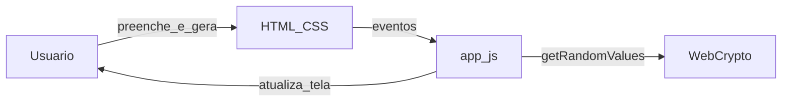

# Guia de execução — Gerador de senhas (web estática)

Este repositório contém **apenas** a interface em [web/](web/): HTML, CSS e JavaScript, sem backend nem pacote Python.

---

## 1. Pré-requisitos

| Item | Detalhe |
|------|---------|
| Navegador | Chrome, Firefox, Edge ou equivalente |
| Git | Opcional, para clonar o repositório |
| Python | Opcional, **3.x** — só para o servidor HTTP de desenvolvimento |

---

## 2. Obter o código

```bash
cd d:\gerarSenha
```

---

## 3. Rodar localmente (recomendado)

Na **raiz** do repositório:

```bash
python -m http.server 8080 --directory web
```

Acesse **http://localhost:8080**.

- Use **Gerar** para criar senhas conforme o formulário.
- **Copiar resultado** usa `navigator.clipboard` (em geral funciona em `localhost` ou HTTPS).

### Alternativa sem Python

Se o seu ambiente tiver outro servidor estático (por exemplo `npx serve web`), pode usá-lo da mesma forma, servindo a pasta `web/`.

---

## 4. Estrutura

| Caminho | Função |
|---------|--------|
| [web/index.html](web/index.html) | Estrutura da página e campos |
| [web/app.js](web/app.js) | Validação (8–64, conjuntos, política mínima), geração com `crypto.getRandomValues` |
| [web/styles.css](web/styles.css) | Aparência e contraste |

---

## 5. Diagrama do fluxo (Mermaid)

**Vantagens de Mermaid no markdown:** versionável no Git e fácil de revisar em pull request.



**Nota:** o fluxo didático **Cliente → API → Service → Repository → Storage** do material refere-se a sistemas com API e persistência. Aqui tudo ocorre **no cliente** (navegador), sem camada de API própria.

---

## 6. Checklist rápido

- [ ] `python -m http.server 8080 --directory web` e página abre em `localhost`
- [ ] Geração e validação batem com as regras do formulário
- [ ] README atualizado e repositório no Git com histórico claro

---

## 7. Git e Conventional Commits

**Formato:** `tipo(escopo): descrição`

**Exemplos (disciplina):**

```text
feat(api): adiciona endpoint POST /tasks
fix(service): corrige validação de prioridade
test(tasks): adiciona testes para criação de tarefa
docs(readme): inclui guia de execução
```

**Exemplos (este projeto):**

```text
feat(web): melhora feedback visual de erros
fix(web): corrige cópia no Safari
docs(guia): documenta porta alternativa do http.server
```

```bash
git add web/app.js
git commit -m "fix(web): corrige mensagem de validação"
```

O padrão também está resumido no [README.md](README.md).

---

## 11. CO-STAR (exemplo para este MVP)

| Letra | Significado | Preenchimento (este projeto) |
|-------|-------------|------------------------------|
| **C** — Contexto | Projeto, stack, restrições | Repositório **gerarSenha**, front **estático**: `web/index.html`, `web/app.js`, `web/styles.css`; sem backend; aleatoriedade com **`crypto.getRandomValues`**. |
| **O** — Objetivo | O que deve ser entregue | Ajustar ou revisar geração de senhas (8–64 caracteres), conjuntos opcionais, política mínima, quantidade até 20, cópia para clipboard; mensagens de erro claras em português. |
| **S** — Estilo e convenções | Padrões | **Conventional Commits** em português; JS legível, sem dependências de build obrigatórias. |
| **T** — Tom | Como escrever | Textos de UI e documentação em **português**, diretos. |
| **A** — Audiência | Quem usa | Usuário final no navegador; corretor/colegas lendo o repositório. |
| **R** — Formato da resposta | Saída esperada | Alterações em `web/`; se pedir diagrama, **Mermaid** no markdown. |

**Exemplo de prompt curto:**

> **Contexto:** Repositório `gerarSenha`, arquivo `web/app.js`.  
> **Objetivo:** Limitar quantidade máxima a 10 em vez de 20.  
> **Estilo:** Conventional Commits; não adicionar frameworks.  
> **Tom:** técnico, português.  
> **Audiência:** mantenedor.  
> **Resposta:** patch em `app.js` e `index.html` se o `max` do input mudar.

---

*Última atualização: projeto somente web estática.*
