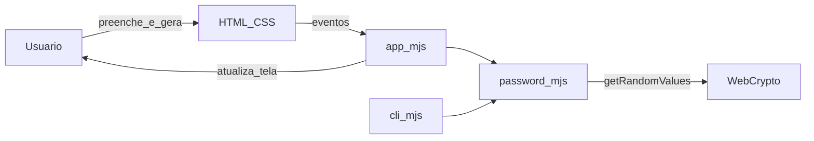

# Gerador de senhas seguras

Aplicação **estática** em HTML/CSS/JavaScript: formulário no navegador para comprimento (8–64), conjuntos de caracteres, política mínima (ao menos um de cada conjunto marcado) e quantidade (1–20). A mesma lógica de validação e geração está em **`web/password.mjs`**, reutilizada pela página (`app.mjs`) e pela **CLI Node** (`cli.mjs`). A aleatoriedade usa apenas **`crypto.getRandomValues`** (sem `Math.random()`).

**Demonstração técnica (3–5 min):** roteiro em [Demo.md](Demo.md).

## Requisitos

- Navegador moderno (Chrome, Firefox, Edge ou equivalente) — para a interface em `web/`
- [Node.js](https://nodejs.org/) **19 ou superior** — apenas para a CLI (`cli.mjs` / `npx gerar-senha`)

## Como executar

### Abrir a página no navegador

**Opção 1 — ficheiro local (`file://`):**

1. No Explorador de ficheiros (Windows), abre a pasta **`web/`** dentro do repositório, por exemplo `d:\gerarSenha\web\`.
2. Faz **duplo clique** em **`index.html`**, ou arrasta esse ficheiro para uma janela do Chrome, Edge ou Firefox.  
   Alternativa: no navegador, **Ficheiro → Abrir ficheiro…** (ou `Ctrl+O`) e escolhe `web\index.html`.
3. Confirma na barra de endereços um URL do tipo `file:///…/web/index.html`. Os recursos `styles.css` e `app.mjs` carregam por caminhos relativos na mesma pasta.

**Nota:** em `file://`, o botão **Copiar resultado** pode não funcionar; nesse caso usa a Opção 2.

**Opção 2 — servidor HTTP local (recomendado para clipboard):** sirva a pasta `web/` com qualquer servidor de arquivos estáticos do seu ambiente (por exemplo extensão **Live Server** / “Simple Browser” no editor, ou o preview HTTP que você já usa). Acesse a URL que o servidor indicar (em geral algo como `http://127.0.0.1:...`). Assim a API de **copiar** costuma funcionar melhor do que em `file://`. Quando **Copiar resultado** funciona, aparece uma **mensagem verde** (“Senha copiada…”) por alguns segundos e depois some sozinha.

**Opção 3 — linha de comando (Node.js):** na raiz do repositório, execute `npm install` (registra o binário localmente) e use `npx gerar-senha --help` ou, em desenvolvimento, `node cli.mjs --length 20 --count 2`. Cada senha sai em uma linha no stdout; erros de validação vão para stderr e o processo termina com código **2**.

**Testes (`npm test`):** na raiz, com Node 19+, `npm test` corre a suíte [`node:test`](https://nodejs.org/api/test.html) em [test/password.test.mjs](test/password.test.mjs) — validação de parâmetros, caracteres só do alfabeto permitido, política “um de cada conjunto” com `requireEach` e uma verificação de fumo de unicidade entre gerações.

## Estrutura

- [web/index.html](web/index.html) — página e formulário
- [web/password.mjs](web/password.mjs) — núcleo: validação e geração com Web Crypto (**JSDoc**)
- [web/app.mjs](web/app.mjs) — formulário, eventos e cópia para o clipboard (mensagem verde de confirmação após copiar com sucesso)
- [web/styles.css](web/styles.css) — estilos
- [cli.mjs](cli.mjs) — CLI que importa o mesmo `password.mjs`
- [package.json](package.json) — `type: "module"`, `engines.node`, `bin.gerar-senha` e script `test`
- [test/password.test.mjs](test/password.test.mjs) — testes automatizados do núcleo (`npm test`)
- [Demo.md](Demo.md) — roteiro de demonstração técnica (3–5 min)

## Segurança (lembretes)

- Prefira senhas longas (16+) e um gerenciador de senhas.
- Não envie senhas geradas para servidores desconhecidos; a página roda **no seu navegador** e a CLI roda **localmente no Node** — sem backend próprio neste repositório.

## Arquitetura (diagrama Mermaid)

Fluxo típico desta aplicação (sem backend):



## Uso de IA no desenvolvimento

Neste projeto utilizou-se **IA generativa** (por exemplo no Cursor) para:

- **estruturar o repositório** — organização em núcleo partilhado (`web/password.mjs`), interface web (`web/app.mjs`, `index.html`, estilos) e CLI Node (`cli.mjs`, `package.json`);
- **produzir e ajustar o código-fonte** com base em **prompts** alinhados aos requisitos (comprimento, conjuntos de caracteres, política mínima, quantidade, `crypto.getRandomValues`, etc.);
- **criar e evoluir os testes automatizados** (`test/password.test.mjs`, `npm test` / [`node:test`](https://nodejs.org/api/test.html)).

A IA também ajudou na **criação e no refinamento dos próprios prompts**, incluindo o encaixe com o framework **CO-STAR** (ver secção seguinte e o [GUIA de execução, CO-STAR](GUIA_DE_EXECUCAO.md#11-co-star-exemplo-para-este-mvp)).

**Transparência:** o resultado foi sempre sujeito a **revisão humana** (comportamento, mensagens em português, consistência entre web, CLI e documentação).

## Prompt estruturado: CO-STAR

Neste repositório, ao usar **IA para gerar ou alterar código-fonte**, o prompt deve seguir **CO-STAR** e a convenção do projeto exige que o **fonte entregue esteja integralmente documentado** (JSDoc em JavaScript; comentários/HTML onde fizer sentido). Detalhes e exemplo preenchido: [GUIA_DE_EXECUCAO.md, seção 11](GUIA_DE_EXECUCAO.md#11-co-star-exemplo-para-este-mvp).

## Commits (padrão do repositório)

Este projeto adota **[Conventional Commits](https://www.conventionalcommits.org/)**: `tipo(escopo): descrição` em português.

| Tipo | Uso |
|------|-----|
| `feat` | Nova funcionalidade |
| `fix` | Correção de bug |
| `docs` | Documentação |
| `chore` | Manutenção |

**Escopos sugeridos:** `web`, `cli`, `test`, `readme`, `guia`.

**Exemplos:**

```text
feat(web): adiciona botão de limpar resultado
fix(web): corrige validação do comprimento mínimo
docs(readme): atualiza instruções de execução local
```

Mais detalhes em [GUIA_DE_EXECUCAO.md](GUIA_DE_EXECUCAO.md). Roteiro de apresentação: [Demo.md](Demo.md).
